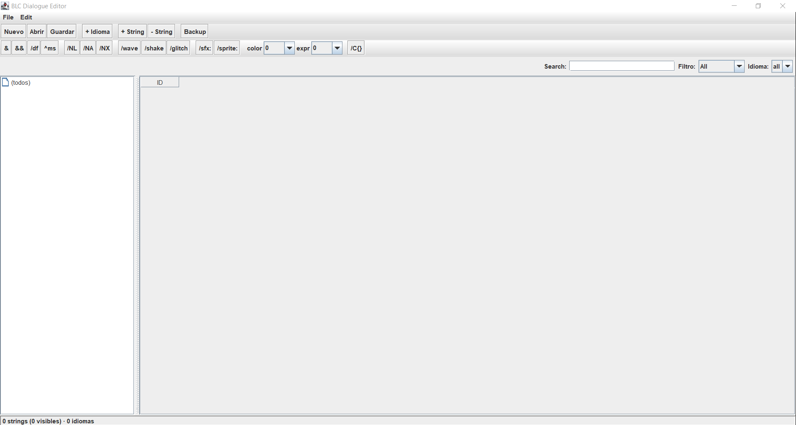

> **Important:** This editor is not magic. It reads and writes plain JSON
> files with string IDs and translations. The dialogue tags supported by
> the tag toolbar (`/wave`, `/shake`, `/glitch`, `/sfx:`, `/sprite:`, `/cN`,
> `/fN`, `/NL`, `/NA`, `/NX`, `/C{...}`, `^N`, `&`, `&&`, `/df`, and the
> `/speaker` syntax) are specific to *this* project's game engine. If your
> game does not implement these tags, the editor will still work as a
> generic JSON translation tool, but you will need to modify the tag
> toolbar, or fork the editor, to match your own dialogue system.

# Bloody Claire Dialogue Editor


A desktop editor for translating game dialogue strings, built with Java Swing.

It reads and writes JSON language files (`lang_XX.json`), groups strings
hierarchically based on dot-separated IDs, and provides a fast workflow
for editing dialogues across multiple languages.




---

## Features

- **Multi-language editing** — open as many `lang_XX.json` files as you
  want and edit them side by side in a single table.
- **Hierarchical groups** — string IDs are grouped automatically using
  dot notation (e.g. `story.intro.001` lives under `story / intro`).
- **Dialogue tags toolbar** — one-click insertion of game tags such as
  `/wave`, `/shake`, `/glitch`, `/sfx:`, `/sprite:`, `/cN`, `/fN`,
  `/NL`, `/NA`, `/NX`, `/C{...}`, `^N`, `&`, `&&`.
- **Search and filters** — filter by ID, translation text, translated
  / missing status, language, or active group.
- **Project-based workflow** — create a new project (folder) and start
  translating from scratch, or open an existing one.
- **Backup of metadata** — group names, colors, and collapsed state are
  stored separately in `backup.json`, without duplicating translations.
- **Windows 95-inspired look** — functional, compact, easy on the eyes
  for long editing sessions.

---

## Project structure

When you create a project, the editor generates this folder layout:


```

my-project/
├── strings.json        # Canonical order of all string IDs
├── backup.json         # Group metadata (names, colors, collapsed state)
├── lang_en.json        # English translations
├── lang_es.json        # Spanish translations
└── lang_jp.json        # Japanese translations

```

### File formats

**`lang_XX.json`** — translations for a single language:

```json
{
  "lang": "en",
  "story.intro.001": "Before time was named...",
  "ui.menu.continue": "Continue",
  "ui.menu.quit": "Exit"
}

```

**`strings.json`** — canonical order of all string IDs:

```json
{
  "version": 1,
  "order": [
    "ui.menu.continue",
    "ui.menu.quit",
    "story.intro.001"
  ]
}

```

**`backup.json`** — optional group metadata:

```json
{
  "version": 1,
  "grupos": {
    "story":       { "nombre": "History",     "colorHex": "#FFAA00" },
    "story.intro": { "nombre": "Introduction", "colorHex": "#FFCC55" }
  },
  "colapsados": ["story.vicky"]
}

```

---

## Requirements

* **Java 26 or newer** (Temurin / OpenJDK recommended)
* **Gson 2.14.0** (bundled into the release JAR)

You can check your Java version with:

```bash
java -version

```

---

## Building from source

### With IntelliJ IDEA (recommended)

1. Clone the repository:
```bash
git clone [https://github.com/Alek0MC2009/Bloody-Claire-Translation.git](https://github.com/Alek0MC2009/Bloody-Claire-Translation.git)

```


2. Open the folder in IntelliJ IDEA.
3. Make sure the project SDK is **Java 26**.
4. Build the JAR:
   `Build → Build Artifacts → Build`

The JAR will appear in:

```
out/artifacts/BLCdialogEditor_jar/ProjectName.jar

```

### From the command line

```bash
javac -d out -cp "libs/gson-2.14.0.jar" \
      src/Main.java \
      src/model/*.java \
      src/service/*.java \
      src/ui/*.java \
      src/util/*.java

# Add Gson into the output directory
cd out
jar xf ../libs/gson-2.14.0.jar
cd ..

# Create the manifest
echo "Main-Class: Main" > manifest.txt

# Package
jar cfm BLCdialogEditor.jar manifest.txt -C out .

```

Run it with:

```bash
java -jar BLCdialogEditor.jar

```

---

## Usage

### Create a new project

1. Launch the editor.
2. Go to `File → New Project...`.
3. Choose an empty folder for your project.
4. Enter the language codes you want to start with, separated by commas
   (for example: `en,es,jp`).
5. The editor creates `strings.json`, `backup.json`, and one
   `lang_XX.json` per language.

### Open an existing project

1. Go to `File → Open Project...`.
2. Select the folder containing your `lang_XX.json` files.

### Add a new string

1. Select a group in the tree on the left.
2. Click **+ String** in the toolbar.
3. The new string will be created with the group's prefix.
4. Edit its ID and translations directly in the table.

### Insert dialogue tags

While editing a cell, click any tag button in the toolbar to insert the
corresponding tag at the cursor position. Tags that need parameters
(`/sfx:`, `/sprite:`, `/C{}`, `^N`) will open a small input dialog.

### Save

* `Ctrl+S` or **Save All** to write every `lang_XX.json`, `strings.json`
  and `backup.json`.
* Use **Backup** to save only the group metadata.

---

## Supported dialogue tags (on my game, on yours you need to change the settings for your dialogue system)

| Tag | Effect |
| --- | --- |
| `&` | Line break |
| `&&` | Literal ampersand |
| `/df` | Reset speaker / voice / color |
| `^N` | Pause for N milliseconds |
| `/NL` `/NA` `/NX` | Insert Lara / Ale / Ximena name |
| `/wave` | Wave effect |
| `/shake` | Shake effect |
| `/glitch` | Glitch effect |
| `/sfx:name` | Play a sound |
| `/sprite:name` | Change sprite |
| `/cN` | Change text color (index N) |
| `/fN` | Change expression (index N) |
| `/C{opt1 | opt2}` |
| `/speaker` | Set current speaker |

---

## Keyboard shortcuts

| Shortcut | Action |
| --- | --- |
| `Ctrl+S` | Save all |
| `Ctrl+O` | Open project |
| `Ctrl+Shift+N` | New project |
| `Ctrl+N` | Add string |
| `Ctrl+F` | Focus search field |

---

## Roadmap

* [ ] Drag & drop reordering of groups
* [ ] Custom group colors and names via context menu
* [ ] Validation of malformed tags
* [ ] Keyboard shortcuts for inserting tags
* [ ] Export / import translations as CSV
* [ ] Native installers via `jpackage`

---

## Contributing

Contributions are welcome. Before opening a pull request, please:

1. Open an issue describing the change you want to make.
2. Keep pull requests focused and small.
3. Match the existing code style (4-space indentation, Javadoc on
   public classes and methods).

---

## License

**Apache License 2.0 with Commons Clause.**
Copyright 2026 Alejandro Bravo Lingyte.

You are free to use, modify, fork, and redistribute this editor for any
purpose, including commercial projects. The only restriction is that
you may not sell the editor itself.

See [LICENSE](https://www.google.com/search?q=LICENSE) for details.

### Third-party libraries

* [Gson](https://github.com/google/gson) — Apache License 2.0.
  See [THIRD_PARTY_LICENSES.txt](https://www.google.com/search?q=THIRD_PARTY_LICENSES.txt).

---

## Acknowledgements

* Inspired by the classic Windows 95 interface.
* Built for translating dialogue-heavy games without fighting with
  browser APIs or online editors.

```

```